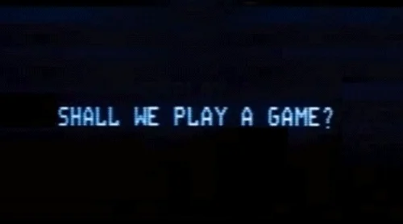

## Constructor Word Guess Game

### Advanced Javascript Assignment (optional)

### In this assignment, you will make a command line word guess game. I incorporated the same 1,291 of the hardest words in the English Language.Good luck

## Technologies Used
    - Node.js
    - Gradient-string
    - ESlint Syntax
    - Constructors

## Demo Pics

### As for most of my projects, early versions look very promising

### But eventually proved to be problematic

### Seriously problematic

## Final Version